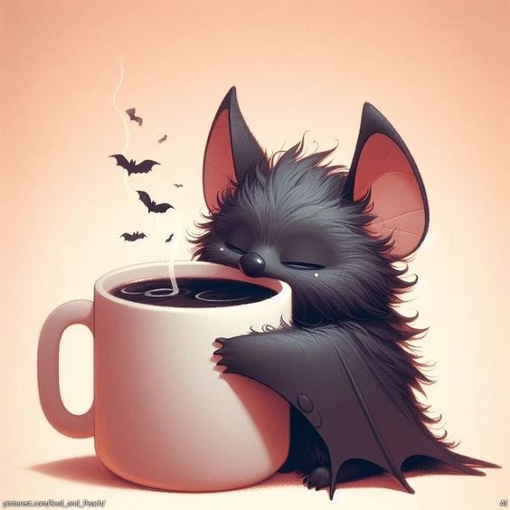

<!DOCTYPE html>
<html lang="en">
<head>
    <meta charset="utf-8">
    <meta name="viewport" content="width=device-width, initial-scale=1.0">
    <link rel="stylesheet" href="css/style.css">
    <title> CV SV 1</title>
    <link rel="icon" href="img/Triquetra.svg">
</head>
<body>

    <header class="header">
        

            

                
            

        
<!--logo -->
        

             <h1 class="header-title"> Smirnova Victoria</h1>
                <h2 class="header-subtitle">Trainee Front-end</h2>
                

    </header>
        

            <nav class="nav">
                <ul class="nav-list">
                    <li class="nav-item"><a class="nav-link" href="index.html#aboutMe">About me</a></li>
                    <li class="nav-item"><a class="nav-link" href="index.html#courses">Courses</a></li>
                    <li class="nav-item"><a class="nav-link" href="index.html#skills">Skills</a></li>
                    <li class="nav-item"><a class="nav-link" href="index.html#languages">Languages</a></li>
                    <li class="nav-item"><a class="nav-link" href="index.html#code">Code</a></li>
                    <li class="nav-item"><a class="nav-link" href="index.html#contacts">Contacts</a></li>
                    <li class="nav-item"><a class="nav-link" href="index.html#Hobbies">Hobbies</a></li>
            </ul>
         </nav>
        
<!-- header-container -->

    

        <section class="section" id="aboutMe">
            <h3 class="content-title">About me</h3>
                

                    
I am currently studying. I have worked in the telecommunications industry. Programming has always fascinated me, and I see myself in this field. I am just getting started and striving for victory. I am a quick learner, not afraid of challenges, and love coffee&#9749;.

                

        </section>
        <section class="section" id="skills">
            <h3 class="content-title">Skills</h3>
                

                    <ul>
                        <li><strong>HTML</strong></li>
                        <li><strong>CSS</strong></li>
                        <li><strong>JavaScript</strong></li>
                        <li><strong>Pascal,Basic</strong></li>
                        <li><strong>Git,GitHub</strong></li>
                        <li><strong>tilda,drupal</strong></li>
                        <li><strong>Figma,Photoshop</strong></li>
                        <li><strong>VS Code,Sublime Text</strong></li>
                    </ul>
                

        </section>
        <section class="section" id="languages">
            <h3 class="content-title">Languages</h3>
                    <ul>
                        <li><strong>English-A2</strong></li>
                        <li><strong>Russian - native</strong></li>
                    </ul>
        </section>
        <section class="section" id="projects">
            <h3 class="content-title">Projects</h3>
                     <ul>
                        <li><strong>CV</strong></li>
                    </ul>
        </section>
        <section class="section" id="courses">
            <h3 class="content-title">Courses</h3>
                    <ul>
                        <li><strong>TGU. Web-programmer from scratch to
                        </strong></li>
                    </ul>
        </section>
        <section class="section" id="EDUCATION">
            <h3 class="content-title">EDUCATION</h3>
                    <ul>
                        <li><strong>"St. Petersburg State University of Telecommunications named after Prof. M.A. Bonch-Bruevich"  Engineer</strong></li>
                    </ul>
        </section>
    

        <section class="section" id="code">
             <h4 class="article-title">Code Example:</h4>
            <article class="article">
                    

                        <code>function multiply(a, b){ a * b }
                        const multiply = a =&#x3E; b =&#x3E; a * b;
                        console.log(multiply(4)(3));</code>
                    

            </article>
        </section>
    

          <section class="section" id="Hobbies">
            <h3 class="content-title">Hobbies</h3>
                    <ul>
                        <li><strong>&hearts; Swimming</strong></li>
                        <li><strong>&hearts; Painting</strong></li>
                        <li><strong>&hearts; Creation</strong></li>
                        <li><strong>&hearts; Floriculture</strong></li>
                    </ul>
        </section>
    
<!-- section-container -->

<aside class="sidebar-blog">
        

            <section class="section-heading" id="profile">
            

            
            

            </section>
        

    <h3 class="sidebar-blog-title">Contact</h3>
    <ul class="sidebar-blog-text">
                        <li><strong>telegram:</strong></li>
                        <li><strong>github:Vikismi</strong></li>
                        <li><strong>discord:</strong></li>
                        <li><strong>&#64;Email:</strong> <a href="mailto:info@website.com">viki198383@mail.ru</a></li>
                    </ul>
</aside><!-- sidebar -->

<!--container -->
<footer class="footer">
    

        
        
&copy;2025 VSolo 

        
    

</footer>

<!-- page -->
</body>
</html>